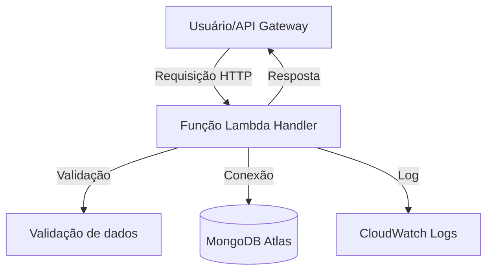

<div align="center">
	<h1>🎬 Lambdaflix</h1>
	<p><b>API Serverless de Filmes</b></p>
	<p><i>Projeto para a disciplina <b>85ESE Engenharia Orientada a Serviços</b> — Workshop de Serverless e FaaS</i></p>
</div>

---

## ✨ Sobre o Projeto

API de filmes construída com:
- <b>AWS Lambda</b> (Node.js 22.x)
- <b>API Gateway</b>
- <b>MongoDB Atlas</b>

Principais práticas:
- Handlers pequenos e desacoplados
- Conexão eficiente com MongoDB
- Validação centralizada
- Idempotência na criação
- Observabilidade via logs estruturados
- Testes automatizados com Vitest

---

## 🗂️ Estrutura do Projeto

```text
src/
	handlers/   # Funções Lambda (createMovie, listMovies, getMovie)
	db/         # Conexão MongoDB
	models/     # Schema/modelo do filme
	utils/      # Validação e logger
tests/        # Testes automatizados
```

---

## 🛠️ Como subir na AWS Lambda e API Gateway

### 1️⃣ Empacotar cada função Lambda
1. Para cada handler (`src/handlers/*.mjs`), crie uma pasta separada.
2. Copie o handler e as dependências necessárias (`src/db`, `src/models`, `src/utils`).
3. Não inclua `node_modules` ainda.

### 2️⃣ Criar um Lambda Layer com node_modules
```bash
npm install --production
mkdir -p layer/nodejs
cp -r node_modules layer/nodejs/
zip -r layer.zip layer
```
No console AWS Lambda, crie um novo Layer e faça upload do `layer.zip`.

### 3️⃣ Subir as funções Lambda
1. Para cada função, compacte os arquivos do handler (ex: `createMovie.mjs`, pastas utilitárias) em um `.zip`.
2. No console AWS Lambda, crie uma função, selecione o runtime Node.js 18.x.
3. Faça upload do `.zip`.
4. Em "Camadas", adicione o Layer criado anteriormente.

### 4️⃣ Configurar variáveis de ambiente
No console da função Lambda, vá em <b>Configuração > Variáveis de ambiente</b> e adicione:
- <b>MONGODB_URI</b>: string de conexão do MongoDB Atlas
- <b>DB_NAME</b>: nome do banco

### 5️⃣ Criar a API Gateway
1. No console do API Gateway, crie uma nova API REST.
2. Crie recursos (ex: `/movies`) e métodos (POST, GET, GET /{id}`).
3. Para cada método, configure a integração com a função Lambda correspondente.
4. Faça deploy da API.

### 6️⃣ Testar
Use o console do API Gateway ou ferramentas como Postman para testar os endpoints.

---

## 🚦 Endpoints

| Método | Rota           | Descrição           |
|--------|----------------|---------------------|
| POST   | /movies        | Cria filme          |
| GET    | /movies        | Lista filmes        |
| GET    | /movies/{id}   | Busca filme por ID  |

### Exemplo de payload para criação
```json
{
	"title": "Chungking Express",
	"year": 1994,
	"genre": "Romance",
	"description": "Dois policiais lidam com términos amorosos em Hong Kong. O 223 cria um ritual comprando latas de abacaxi com validade em 1º de maio, enquanto se envolve com uma misteriosa mulher loira. Já o 663, abandonado pela namorada, tem sua rotina transformada por uma garçonete que entra em sua vida de forma inesperada."
}
```

---

## 🧪 Testes Automatizados

Execute:
```bash
npm test
```
para rodar os testes com Vitest.

---

## 📊 Observabilidade

Logs estruturados em JSON são enviados automaticamente para o CloudWatch.

---

## 🗺️ Fluxograma do Projeto



---

<div align="center">
	<b>Desenvolvido por Nathalia Acordi e Nicolas Weber para fins acadêmicos.</b>
</div>
