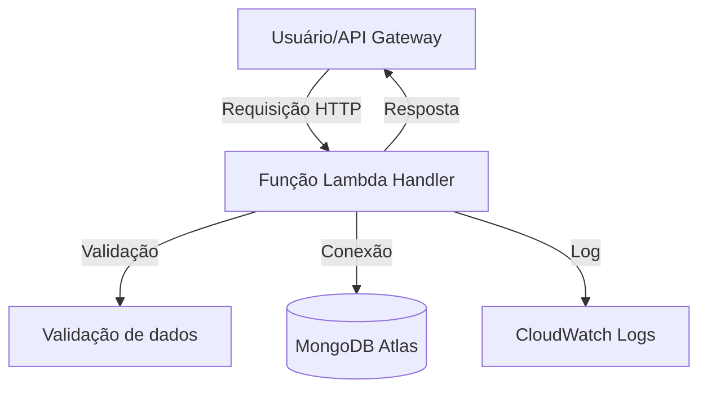

<div align="center">
  <h1>🎬 Lambdaflix 🍿</h1>
  <p><b>API Serverless de Filmes</b></p>
  <p><i>Projeto para a disciplina <b>85ESE Engenharia Orientada a Serviços</b> — Workshop de Serverless e FaaS</i></p>
</div>

<div align="center">
  <a href="https://nodejs.org/"></a>&nbsp;&nbsp;
  <a href="https://docs.aws.amazon.com/lambda/"></a>&nbsp;&nbsp;
  <a href="https://www.mongodb.com/atlas"></a>&nbsp;&nbsp;
  <a href="https://vitest.dev/"></a>
</div>

---

## 💻 Instalação Local e Dependências

```bash
# Clone o repositório

cd lambdaflix

# Instale as dependências
npm install

# Execute os testes automatizados
npm test
```

---

## 📁 Estrutura do Projeto

```text
src/
  handlers/   # Funções Lambda (createMovie, listMovies, getMovie)
  db/         # Conexão MongoDB
  models/     # Schema/modelo do filme
  utils/      # Validação e logger
tests/        # Testes automatizados
```

---

## 🔗 Endpoints

| Método | Rota           | Descrição           |
|--------|----------------|---------------------|
| POST   | /movies        | Cria filme          |
| GET    | /movies        | Lista filmes        |
| GET    | /movies/{id}   | Busca filme por ID  |

---


## 📦 Payloads e Respostas

<details>
<summary><strong>Ver exemplos de payloads e respostas</strong></summary>

<details>
<summary><b>POST /movies</b></summary>

**Payload:**
```json
{
  "title": "In the Mood for Love",
  "year": 2000,
  "genre": "Romance/Drama",
  "description": "Dois vizinhos desenvolvem uma relação especial em Hong Kong dos anos 60."
}
```

**Resposta 201:**
```json
{
  "_id": "650c1e2f8b1e8a001f8e4a12",
  "title": "In the Mood for Love",
  "year": 2000,
  "genre": "Romance/Drama",
  "description": "Dois vizinhos desenvolvem uma relação especial em Hong Kong dos anos 60."
}
```

**Resposta 400:**
```json
{
  "error": "Campo 'title' é obrigatório."
}
```

</details>

<details>
<summary><b>GET /movies</b></summary>

**Resposta 200:**
```json
[
  {
    "_id": "650c1e2f8b1e8a001f8e4a12",
    "title": "In the Mood for Love",
    "year": 2000,
    "genre": "Romance/Drama",
    "description": "Dois vizinhos desenvolvem uma relação especial em Hong Kong dos anos 60."
  },
  {
    "_id": "650c1e2f8b1e8a001f8e4a13",
    "title": "Chungking Express",
    "year": 1994,
    "genre": "Romance",
    "description": "Dois policiais lidam com términos amorosos em Hong Kong. O 223 cria um ritual comprando latas de abacaxi com validade em 1º de maio, enquanto se envolve com uma misteriosa mulher loira. Já o 663, abandonado pela namorada, tem sua rotina transformada por uma garçonete que entra em sua vida de forma inesperada."
  }
]
```

</details>

<details>
<summary><b>GET /movies/{id}</b></summary>

**Resposta 200:**
```json
{
  "_id": "650c1e2f8b1e8a001f8e4a12",
  "title": "In the Mood for Love",
  "year": 2000,
  "genre": "Romance/Drama",
  "description": "Dois vizinhos desenvolvem uma relação especial em Hong Kong dos anos 60."
}
```

**Resposta 404:**
```json
{
  "error": "Filme não encontrado."
}
```

</details>

</details>

---

## 🚀 Deploy na AWS Lambda & API Gateway

### 1️⃣ Empacotar cada função Lambda
Para cada handler (`src/handlers/*.mjs`):
1. Crie uma pasta separada para cada função.
2. Copie o handler e as dependências necessárias (`src/db`, `src/models`, `src/utils`).
3. Não inclua `node_modules` ainda.

### 2️⃣ Criar um Lambda Layer com node_modules
No terminal, execute:
```bash
npm install --production
mkdir -p layer/nodejs
cp -r node_modules layer/nodejs/
zip -r layer.zip layer
```
No console AWS Lambda, crie um novo Layer e faça upload do `layer.zip`.

### 3️⃣ Subir as funções Lambda
1. Para cada função, compacte os arquivos do handler (ex: `createMovie.mjs`, pastas utilitárias) em um `.zip`.
2. No console AWS Lambda, crie uma função, selecione o runtime Node.js 18.x ou superior.
3. Faça upload do `.zip`.
4. Em "Camadas", adicione o Layer criado anteriormente.

### 4️⃣ Configurar variáveis de ambiente
No console da função Lambda, vá em <b>Configuração > Variáveis de ambiente</b> e adicione:
- <b>MONGODB_URI</b>: string de conexão do MongoDB Atlas
- <b>DB_NAME</b>: nome do banco

### 5️⃣ Criar a API Gateway
1. No console do API Gateway, crie uma nova API REST.
2. Crie recursos (ex: `/movies`) e métodos (POST, GET, GET /{id}).
3. Para cada método, configure a integração com a função Lambda correspondente.
4. Faça deploy da API.

### 6️⃣ Testar
Use o console do API Gateway ou ferramentas como Postman para testar os endpoints.

---

## 📊 Observabilidade

Logs estruturados em JSON são enviados automaticamente para o CloudWatch.

---

## 🗺️ Fluxograma do Projeto


---

<div align="center" style="margin-top: 2em; background: linear-gradient(90deg,#ff9800,#ff3c3c,#6e9f18,#00bcd4); color: white; padding: 1em 0; border-radius: 8px; font-weight: bold; font-size: 1.1em;">
  Desenvolvido por Nathalia Acordi e Nicolas Weber para fins acadêmicos.
</div>
