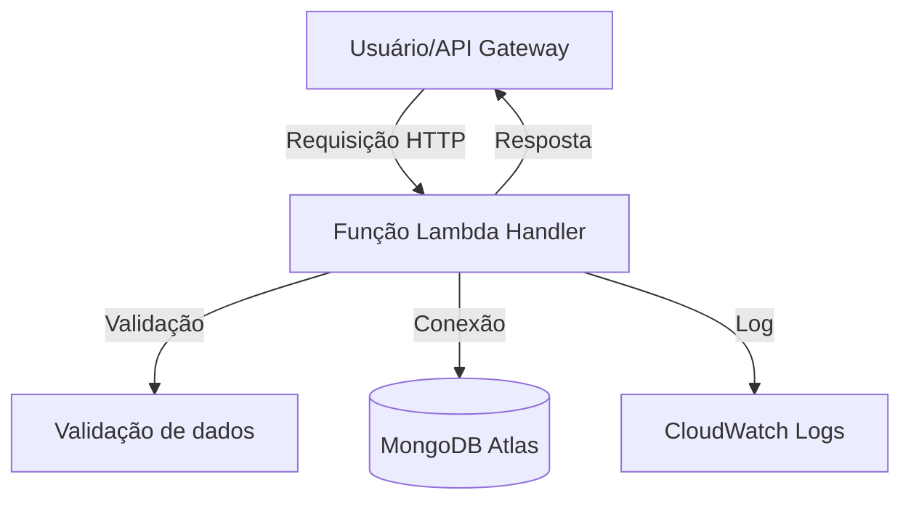

<div align="center">
  <h1>🎬 Lambdaflix 🍿</h1>
  <p><b>API Serverless de Filmes</b></p>
  <p><i>Projeto para a disciplina <b>85ESE Engenharia Orientada a Serviços</b> — Workshop de Serverless e FaaS</i></p>
</div>

<div align="center">
  <a href="https://nodejs.org/"></a>&nbsp;&nbsp;
  <a href="https://docs.aws.amazon.com/lambda/"></a>&nbsp;&nbsp;
  <a href="https://www.mongodb.com/atlas"></a>&nbsp;&nbsp;
  <a href="https://vitest.dev/"></a>
</div>

---


## 📦 Instalação local e dependências

```bash
# Clone o repositório
git clone https://github.com/nathalia-acordi/lambdaflix.git
cd lambdaflix/lambdaflix

# Instale as dependências
npm install

# Execute os testes automatizados
npm test
```

---


## 🗂️ Estrutura do projeto

```text
src/
  handlers/   # Funções Lambda (createMovie, listMovies, getMovie)
  db/         # Conexão MongoDB
  models/     # Schema/modelo do filme
  utils/      # Validação e logger
tests/        # Testes automatizados
```


### 📑 O que faz cada arquivo/pasta

<div align="center">

| Caminho                | Descrição                                                                 |
|------------------------|---------------------------------------------------------------------------|
| src/handlers/          | Funções Lambda: ponto de entrada da API (createMovie, listMovies, getMovie) |
| src/utils/             | Funções utilitárias: validação de dados, logger, helpers                   |
| src/models/            | Schema/modelo do filme para o MongoDB                                      |
| src/db/                | Conexão e utilitários para acesso ao MongoDB                               |
| tests/                 | Testes automatizados com Vitest                                            |
| package.json           | Dependências, scripts e metadados do projeto                               |
| README.md              | Documentação do projeto                                                    |

</div>


---


## 🔗 Endpoints

<div align="center">

| Método | Rota           | Descrição           |
|--------|----------------|---------------------|
| POST   | /movies        | Cria filme          |
| GET    | /movies        | Lista filmes        |
| GET    | /movies/{id}   | Busca filme por ID  |

</div>

---


## 📋 Exemplos de payloads e respostas

<details>
<summary><strong>Ver exemplos de payloads e respostas</strong></summary>

<details>
<summary><b>POST /movies</b></summary>

**Payload:**
```json
{
  "title": "In the Mood for Love",
  "year": 2000,
  "genre": "Romance/Drama",
  "description": "Dois vizinhos desenvolvem uma relação especial em Hong Kong dos anos 60."
}
```

**Resposta 201:**
```json
{
  "_id": "650c1e2f8b1e8a001f8e4a12",
  "title": "In the Mood for Love",
  "year": 2000,
  "genre": "Romance/Drama",
  "description": "Dois vizinhos desenvolvem uma relação especial em Hong Kong dos anos 60."
}
```

**Resposta 400:**
```json
{
  "error": "Campo 'title' é obrigatório."
}
```

</details>

<details>
<summary><b>GET /movies</b></summary>

**Resposta 200:**
```json
[
  {
    "_id": "650c1e2f8b1e8a001f8e4a12",
    "title": "In the Mood for Love",
    "year": 2000,
    "genre": "Romance/Drama",
    "description": "Dois vizinhos desenvolvem uma relação especial em Hong Kong dos anos 60."
  },
  {
    "_id": "650c1e2f8b1e8a001f8e4a13",
    "title": "Chungking Express",
    "year": 1994,
    "genre": "Romance",
    "description": "Dois policiais lidam com términos amorosos em Hong Kong. O 223 cria um ritual comprando latas de abacaxi com validade em 1º de maio, enquanto se envolve com uma misteriosa mulher loira. Já o 663, abandonado pela namorada, tem sua rotina transformada por uma garçonete que entra em sua vida de forma inesperada."
  }
]
```

</details>

<details>
<summary><b>GET /movies/{id}</b></summary>

**Resposta 200:**
```json
{
  "_id": "650c1e2f8b1e8a001f8e4a12",
  "title": "In the Mood for Love",
  "year": 2000,
  "genre": "Romance/Drama",
  "description": "Dois vizinhos desenvolvem uma relação especial em Hong Kong dos anos 60."
}
```

**Resposta 404:**
```json
{
  "error": "Filme não encontrado."
}
```

</details>

</details>

---


## 🚀 Deploy na AWS Lambda e API Gateway


### 📦 Passo 1: Empacotar cada função Lambda

**💻 PowerShell (Windows):**
1. Crie a pasta `dist` se não existir:
  ```powershell
  New-Item -ItemType Directory -Force -Path dist
  ```
2. Empacote cada função (exemplo para createMovie):
  ```powershell
  Compress-Archive -Path src/handlers/createMovie.mjs,src/utils,src/models,src/db -DestinationPath dist/createMovie.zip -Force
  Compress-Archive -Path src/handlers/listMovies.mjs,src/utils,src/models,src/db -DestinationPath dist/listMovies.zip -Force
  Compress-Archive -Path src/handlers/getMovie.mjs,src/utils,src/models,src/db -DestinationPath dist/getMovie.zip -Force
  ```

**🐧 Linux/MacOS:**
1. Crie a pasta `dist` se não existir e compacte cada função:
  ```bash
  mkdir -p dist
  zip -r dist/createMovie.zip src/handlers/createMovie.mjs src/utils src/models src/db
  zip -r dist/listMovies.zip src/handlers/listMovies.mjs src/utils src/models src/db
  zip -r dist/getMovie.zip src/handlers/getMovie.mjs src/utils src/models src/db
  ```
> Inclua sempre todos os arquivos/pastas que o handler importa (utils, models, db, etc). O zip deve conter a estrutura esperada pelo código.

### 📚 Passo 2: Criar um Lambda Layer com node_modules

**💻 PowerShell (Windows):**
1. Crie a estrutura esperada pelo Lambda Layer:
  ```powershell
  New-Item -ItemType Directory -Force -Path layer\nodejs
  Copy-Item node_modules layer\nodejs\ -Recurse
  Compress-Archive -Path layer\* -DestinationPath dist\layer.zip -Force
  ```

**🐧 Linux/MacOS:**
1. Crie a estrutura esperada pelo Lambda Layer:
  ```bash
  mkdir -p layer/nodejs
  cp -r node_modules layer/nodejs/
  zip -r dist/layer.zip layer/*
  ```
2. No console AWS Lambda, crie um novo Layer e faça upload do `dist/layer.zip`.

### ☁️ Passo 3: Subir as funções Lambda
1. No console AWS Lambda, crie uma função para cada handler, selecione o runtime Node.js 18.x ou superior.
2. Faça upload do `.zip` correspondente (ex: `createMovie.zip`).
3. Em "Camadas", adicione o Layer criado anteriormente.

### ⚙️ Passo 4: Configurar variáveis de ambiente
1. No console da função Lambda, vá em **Configuração > Variáveis de ambiente** e adicione:
  - **MONGODB_URI**: string de conexão do MongoDB Atlas
  - **DB_NAME**: nome do banco

### 🌐 Passo 5: Criar a API Gateway
1. No console do API Gateway, crie uma nova API REST.
2. Crie recursos (ex: `/movies`) e métodos (POST, GET, GET /{id}).
3. Para cada método, configure a integração com a função Lambda correspondente.
4. Faça deploy da API.

### 🧪 Passo 6: Testar
1. Use o console do API Gateway ou ferramentas como Postman para testar os endpoints.

---

## 📊 Observabilidade

Logs estruturados em JSON são enviados automaticamente para o CloudWatch.

---

## 🗺️ Fluxograma do projeto


---

<div align="center" style="margin-top: 2em; background: linear-gradient(90deg,#ff9800,#ff3c3c,#6e9f18,#00bcd4); color: white; padding: 1em 0; border-radius: 8px; font-weight: bold; font-size: 1.1em;">
  Desenvolvido por Nathalia Acordi e Nicolas Weber para fins acadêmicos.
</div>
