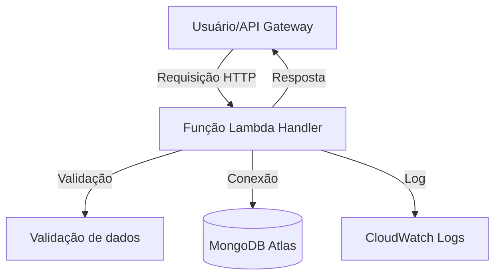

<div align="center">

# 🎬 Lambdaflix 🍿

**API Serverless de Filmes**

*Projeto para a disciplina **85ESE Engenharia Orientada a Serviços** — Workshop de Serverless e FaaS*

<br>


</div>

----

## 📦 Instalação local e dependências

```bash
# Clone o repositório
git clone https://github.com/nathalia-acordi/lambdaflix.git
cd lambdaflix/lambdaflix

# Instale as dependências
npm install

# Execute os testes automatizados
npm test
```

---


## 🗂️ Estrutura do projeto


```text
handlers/   # Funções Lambda (createMovie, listMovies, getMovie, updateMovie)
db/         # Conexão MongoDB
models/     # Schema/modelo do filme
utils/      # Validação e logger
tests/      # Testes automatizados
```


### 📑 O que faz cada arquivo/pasta


| Caminho         | Descrição                                                                 |
|-----------------|---------------------------------------------------------------------------|
| src/handlers/   | Funções Lambda: ponto de entrada da API (createMovie, listMovies, getMovie, updateMovie) |
| src/utils/      | Funções utilitárias: validação de dados, logger, helpers                   |
| src/models/     | Schema/modelo do filme para o MongoDB                                      |
| src/db/         | Conexão e utilitários para acesso ao MongoDB                               |
| tests/          | Testes automatizados com Vitest                                            |
| package.json    | Dependências, scripts e metadados do projeto                               |
| README.md       | Documentação do projeto                                                    |


---


## 🔗 Endpoints


| Método | Rota         | Descrição           |
|--------|--------------|---------------------|
| POST   | /movies        | Cria filme               |
| GET    | /movies        | Lista filmes             |
| GET    | /movies/{id}   | Busca filme por ID       |
| PUT    | /movies/{id}   | Atualiza filme por ID    |

---


## 📋 Exemplos de payloads e respostas


### Exemplos de payloads e respostas

#### POST /movies

**Payload:**

```json
{
  "title": "In the Mood for Love",
  "year": 2000,
  "genre": "Romance/Drama",
  "description": "Dois vizinhos desenvolvem uma relação especial em Hong Kong dos anos 60."
}
```

**Resposta 201:**

```json
{
  "_id": "650c1e2f8b1e8a001f8e4a12",
  "title": "In the Mood for Love",
  "year": 2000,
  "genre": "Romance/Drama",
  "description": "Dois vizinhos desenvolvem uma relação especial em Hong Kong dos anos 60."
}
```

**Resposta 400:**

```json
{
  "error": "Campo 'title' é obrigatório."
}
```

#### GET /movies

**Resposta 200:**

```json
[
  {
    "_id": "650c1e2f8b1e8a001f8e4a12",
    "title": "In the Mood for Love",
    "year": 2000,
    "genre": "Romance/Drama",
    "description": "Dois vizinhos desenvolvem uma relação especial em Hong Kong dos anos 60."
  },
  {
    "_id": "650c1e2f8b1e8a001f8e4a13",
    "title": "Chungking Express",
    "year": 1994,
    "genre": "Romance",
    "description": "Dois policiais lidam com términos amorosos em Hong Kong. O 223 cria um ritual comprando latas de abacaxi com validade em 1º de maio, enquanto se envolve com uma misteriosa mulher loira. Já o 663, abandonado pela namorada, tem sua rotina transformada por uma garçonete que entra em sua vida de forma inesperada."
  }
]
```

#### GET /movies/{id}

**Resposta 200:**

```json
{
  "_id": "650c1e2f8b1e8a001f8e4a12",
  "title": "In the Mood for Love",
  "year": 2000,
  "genre": "Romance/Drama",
  "description": "Dois vizinhos desenvolvem uma relação especial em Hong Kong dos anos 60."
}
```

**Resposta 404:**

```json
{
  "error": "Filme não encontrado."
}
```

---


## 🚀 Deploy na AWS Lambda e API Gateway


### 📦 Passo 1: Empacotar cada função Lambda

**💻 PowerShell (Windows):**
1. Crie a pasta `dist` se não existir:
  ```powershell
  New-Item -ItemType Directory -Force -Path dist
  ```
2. Empacote cada função (exemplo para createMovie):
  ```powershell
  Compress-Archive -Path src/handlers/createMovie.mjs,src/utils,src/models,src/db -DestinationPath dist/createMovie.zip -Force
  Compress-Archive -Path src/handlers/listMovies.mjs,src/utils,src/models,src/db -DestinationPath dist/listMovies.zip -Force
  Compress-Archive -Path src/handlers/getMovie.mjs,src/utils,src/models,src/db -DestinationPath dist/getMovie.zip -Force
  ```

**🐧 Linux/MacOS:**
1. Crie a pasta `dist` se não existir e compacte cada função:
  ```bash
  mkdir -p dist
  zip -r dist/createMovie.zip src/handlers/createMovie.mjs src/utils src/models src/db
  zip -r dist/listMovies.zip src/handlers/listMovies.mjs src/utils src/models src/db
  zip -r dist/getMovie.zip src/handlers/getMovie.mjs src/utils src/models src/db
  ```
> Inclua sempre todos os arquivos/pastas que o handler importa (utils, models, db, etc). O zip deve conter a estrutura esperada pelo código.

### 📚 Passo 2: Criar um Lambda Layer com node_modules

**💻 PowerShell (Windows):**
1. Crie a estrutura esperada pelo Lambda Layer:
  ```powershell
  New-Item -ItemType Directory -Force -Path layer\nodejs
  Copy-Item node_modules layer\nodejs\ -Recurse
  Compress-Archive -Path layer\* -DestinationPath dist\layer.zip -Force
  ```

**🐧 Linux/MacOS:**
1. Crie a estrutura esperada pelo Lambda Layer:
  ```bash
  mkdir -p layer/nodejs
  cp -r node_modules layer/nodejs/
  zip -r dist/layer.zip layer/*
  ```
2. No console AWS Lambda, crie um novo Layer e faça upload do `dist/layer.zip`.

### ☁️ Passo 3: Subir as funções Lambda
1. No console AWS Lambda, crie uma função para cada handler, selecione o runtime Node.js 18.x ou superior.
2. Faça upload do `.zip` correspondente (ex: `createMovie.zip`).
3. Em "Camadas", adicione o Layer criado anteriormente.

### ⚙️ Passo 4: Configurar variáveis de ambiente
1. No console da função Lambda, vá em **Configuração > Variáveis de ambiente** e adicione:
  - **MONGODB_URI**: string de conexão do MongoDB Atlas
  - **DB_NAME**: nome do banco

### 🌐 Passo 5: Criar a API Gateway
1. No console do API Gateway, crie uma nova API REST.
2. Crie recursos (ex: `/movies`) e métodos (POST, GET, GET /{id}).
3. Para cada método, configure a integração com a função Lambda correspondente.
4. Faça deploy da API.

### 🧪 Passo 6: Testar

1. Use o console do API Gateway ou ferramentas como Postman para testar os endpoints.

---

## ℹ️ Observação importante sobre nomes de arquivos no AWS Lambda

⚠️ **Atenção:** Em muitos ambientes AWS Lambda, apenas arquivos chamados `index.js` ou `index.mjs` são reconhecidos como entrypoint, mesmo que o campo Handler seja configurável. Por isso, recomenda-se:

1. Para cada função, renomeie o arquivo principal do handler para `index.mjs` dentro do .zip antes de fazer upload.
2. O campo Handler deve ser sempre:

  ```
  index.handler
  ```

3. O arquivo `index.mjs` deve exportar a função handler normalmente:

  ```js
  export const handler = async (event) => { /* ... */ }
  ```

> Assim, você garante compatibilidade total com o Lambda, independentemente do ambiente ou método de deploy.

---

## 📊 Observabilidade

Para visualizar os logs, acesse o serviço **CloudWatch Logs** no console AWS, selecione o grupo de logs da sua função Lambda e procure pelas entradas em JSON.


### 🛠️ Utils: Validação e Logger

O projeto utiliza dois utilitários principais para garantir robustez e observabilidade:

**1. Validação (`validate`)**
- Garante que todo payload enviado para criar um filme siga o schema esperado.
- Se faltar algum campo obrigatório (ex: `title`) ou algum campo estiver com tipo errado, a função retorna erro 400 e uma mensagem clara, como:

  ```json
  {
    "error": "Campo 'title' é obrigatório."
  }
  ```
- Para testar a validação, envie um payload inválido (ex: sem o campo `title`) para o endpoint POST `/movies` e veja a resposta de erro.

**2. Logger (`logger`)**
- Todos os eventos importantes (erros, avisos, operações de negócio) são registrados em logs estruturados no formato JSON.
- Esses logs são enviados automaticamente para o AWS CloudWatch.
- Exemplo de log:

  ```json
  {
    "timestamp": "2025-09-19T22:50:35.726Z",
    "message": "Filme já existe",
    "title": "In the Mood for Love",
    "year": 2000
  }
  ```


Esses utilitários garantem que erros sejam detectados rapidamente e que o comportamento da API seja auditável e transparente em produção.

---

## 🗺️ Fluxograma do projeto



---


<div align="center">
Desenvolvido por Nathalia Acordi e Nicolas Weber para fins acadêmicos.
</div>
